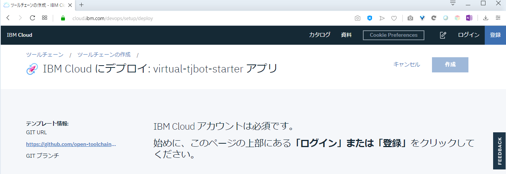
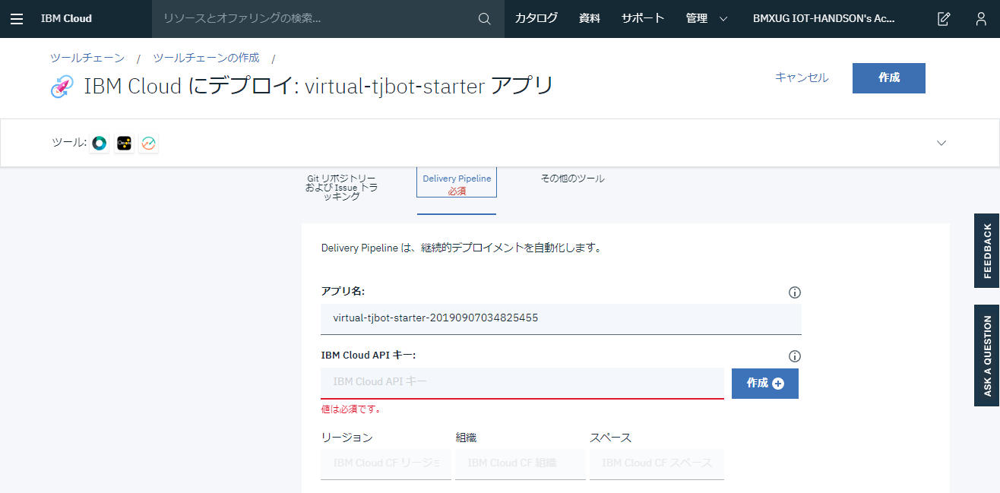
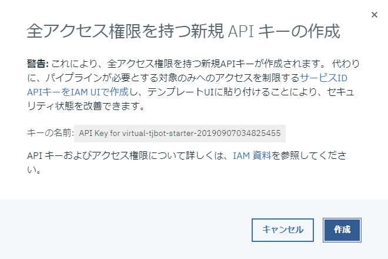
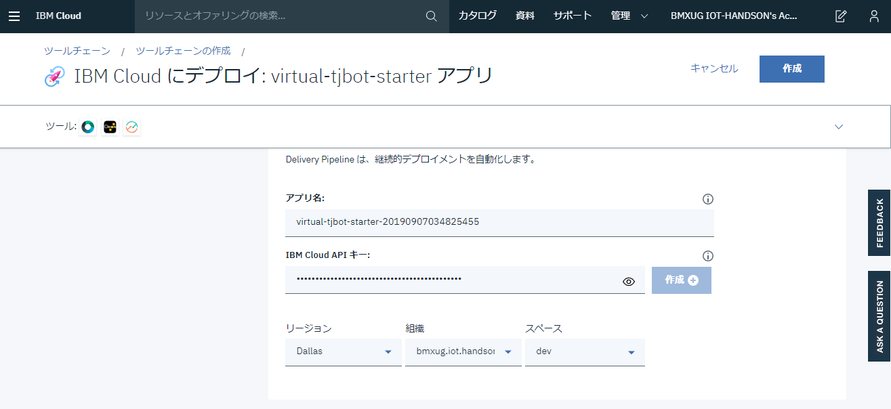
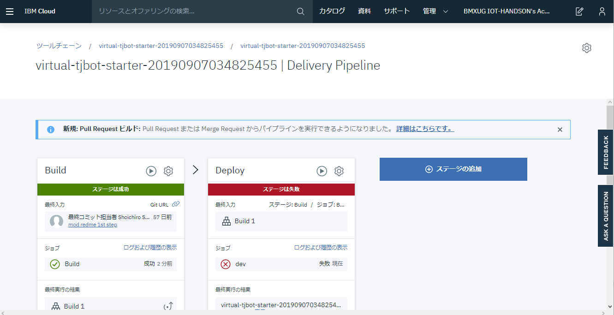
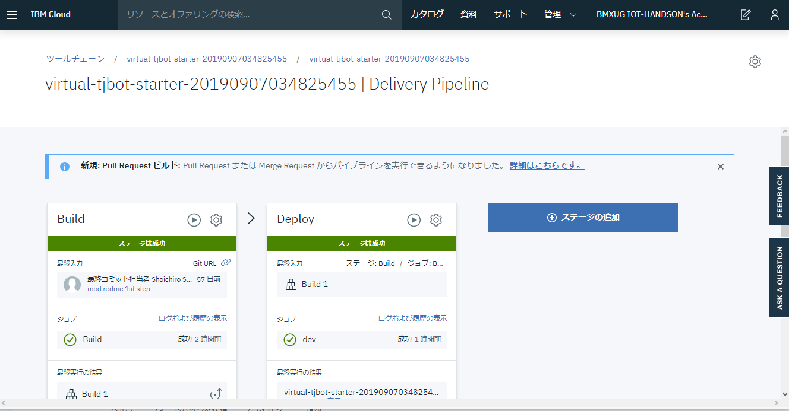
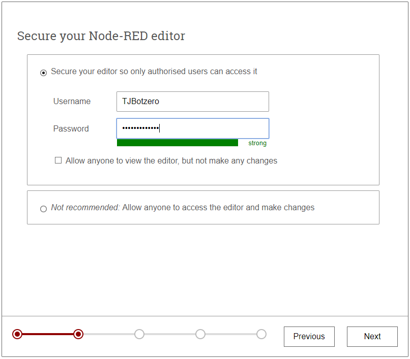

# Hello, Virtual TJBot

BMXUG TJBotFan
(IBM Cloud Community)

IBM Champion

Shoichiro Sakaigawa / @l_s_s_l

---

## Whoami

Shoichiro Sakaigawa

IBMChampion Cloud 2018-2019

Pumpkin Heads 株式会社代表取締役
 
 
著書：

コンテナ・ベース・オーケストレーション
Docker/Kubernetes で作るクラウド時代のシステム基盤 
第 7 章 Kubernetes on IBM Cloud Container Service
（共著 第７章 Kubernetes Service、翔泳社）

---

## Whoami

寄稿：

月刊 I/O 2019 年 3 月号

「＜ Node-RED ＞　「AWS IoT ボタン」を用いて「お知らせ機能」を作る」

@IT IBMChampion 連載記事

「もっとスケーラブルな WordPress 実装を Kubernetes クラスター上にデプロイする」

https://www.atmarkit.co.jp/ait/articles/1905/19/news002.html

---

### What's IBM Champion?

IBM の US 本社が世界で活躍するエンジニアの活動実績を表彰・認定する制度
コミュニティ活動、登壇、執筆などの実績を申請することで獲得することができます。

受賞後は IBM の公式外部エヴァンジェリストとして活動を行う事ができます。

受賞者限定グッズやイベント優待などがあります。

---

# What's Node-RED

IBM 英国 Hursley 研究所のメンバーを中心に開発された、ハードウェアデバイス、API、オンラインサービスを連携させることができる開発用ツールです。

ブラウザベースのエディタから多種多様なノードを結びつけて容易にフローを作成できます。

---

# 用語解説

---

### ノード

予め機能が登録された部品。

自分でこのノードを Node.js を始めプログラミングして、公開することも可能。

---

### フロー

プログラムの流れを「フロー」として「フローエディタ」と呼ばれる編集画面に
使いたい部品（ノード）を並べて、線で結ぶことでプログラムを作ることができます。

---

# What's Virtual TJBot

物理の TJBot を手に入れる前に試したい・実機ハンズオンで TJBot は無いけど同等のコマンドが試せないかということで
Node-RED のフローエディタ上で動作する Virtual TJBot を紹介します。

---

このプレゼンテーションでは、Node-RED の構築から Virtual TJBot の設定までを自動的に行うことができる`Virutal-TJBot-Starter`というパッケージを利用します。

### https://bit.ly/virtualTJBot

---

## どうやって動いているの？

Virtual TJBot は、Node-RED の Virutal TJBot ノードを利用して稼働しています。

ここで紹介するのは IBM Cloud 上の Cloud Foundry Node.js サービスを利用した Node-RED のプラットフォーム上へ自動設定を行う方法です。

この設定自動化によりどなたでもかんたんにハンズオン同等の環境を構築することが可能となります。

---

## 前提条件

- IBM Cloud ライトアカウントもしくはそれ以上が必要
- 過去に Node-RED を IBM Cloud で立ち上げたことが無いこと
  - このハンズオン中に過去 Node-RED を動かしたことがある方は個別にご相談ください
- PC からアクセスすること
  - 設定完了後はお好きな Node-RED のフローエディタが動けばどこでも問題ありません

---

## 設定方法

１. Virtual TJBot Starter Application のページへアクセスする

https://bit.ly/virtualTJBot

---

２． `Deploy to IBM Cloud`ボタンをクリックする

３． IBM Cloud へログインしていない場合はここでログインを行う

---

４． IBM Cloud へのセットアップ画面になります。
ツールチェーン名などは、今回デフォルトのまま進みます。

---

※Note：
ツールチェーンとは、git や Delivery Pipeline という設定自動化を行う CI/CD ツールが動くようセットアップされるグループをさします。
IBM Cloud ツールチェーンは、DevOps 項目から利用ができ、PaaS 環境のセットアップや kubernetes 環境へのアプリケーション配布などができる仕組みです。

---

５． 必須設定項目の`Delivery Pipeline`をクリックします。

６． `IBM Cloud APIキー：`と書かれた項目が現在空欄となっています。
この項目はみなさんの IBM Cloud カウントそれぞれに紐づく内容のため、
`作成`ボタンをクリックして生成します。

---

７． API キーを新規作成するにあたり警告が表示されます。
この手順ではクラウドのサービスを自動的に作成する権限を持つ API キー（合言葉）を作成・登録することになります。
細かくこの合言葉に対して許可する範囲を IAM という機能で設定が可能です。
今回は自動的に IBM Cloud のサービスを一部作成するため、
このまま`作成`をクリックします。

---

８． `IBM Cloud APIキー:`の項目、`リージョン`、`組織`、`スペース`が埋まったことを確認して、画面上部の`作成`をクリックします

---

９．これで Virtual TJBot を起動する準備ができました。
画面中央の`Delivery Pipeline`をクリックして完了状態を確認しましょう。

---

## 失敗してしまった

---

１０． 失敗してしまう場合は・・・

Deploy の項目にある再生ボタンをクリックします。

---

※失敗する理由：

さまざまな理由が考えられますが、IBM Cloud 内での処理プロセスのなかでタイムアウトなどが起こりエラーが発生する場合があります。３回ほど試しても進まない場合は、スタッフへご相談ください

---

１１． 設定の完了
Deploy の項目が緑になり、`ステージは成功`となったら完了です。

１２． ブラウザの戻るボタンで戻り、画面上部の`アプリURLにアクセス`をクリックします。

---

１３． Node-RED の初期ウィザードが表示されます。`Next`をクリックします。

---

１４． Node-RED のフローエディタをアクセスする際に必要な Username と Password を決めて、`Next`をクリックします。 
※チェックボックスにチェックを入れると、フローエディタを読み取り専用で開くことができるようになります。

---

１５． `Next`をクリックします

ここでは詳細を説明しませんが、アプリケーション稼働状況（CPU/メモリなど）を表示する場合は URL を控えてチェックをオンにします。

---

１６． IBM Cloud と Node-RED を組み合わせて使うにあたり便利な Node の紹介です。
ここでは何もせず`Next`をクリックします

---

１７． `Finish`をクリックしてインストールの完了です。

---

## 操作編

---

１． 設定作業が完了すると、ログイン手前の画面が表示されます。
この画面がログイン URL になるので、適宜ブックマークなどしておくと良いでしょう。
`Go to your Node-RED flow editor`ボタンをクリックして進みます。

---

２．設定編で設定した Username と Password を入力して`ログイン`をクリックします。

---

３．フローエディタが表示されます。

---

４．Virtual TJBot のパネルを開きます。
画面右上の ▼ 記号をクリックして、Virtual TJBot をクリックします。

---

５．Sample タブの`(2) Blink LED`のフローが自動で起動して、色が順番に変わっていきます。

---

## Virtual TJBot と物理の TJBot との違い

ここまでで Virtual TJBot の起動について紹介しました。

TJBotFan のハンズオンで使用されている Node-RED フローが、
Virtual TJBot 版に移植されています。

ここでは、物理の TJBot で実現していたものを、
Virtual TJBot ではどのように置き換えをしているのか差分を紹介します。

---

### ハンズオンフローの対比表

| 物理版                | VirtualTJBot                                     |
| :-------------------- | :----------------------------------------------- |
| IP アドレスをしゃべる | 廃止                                             |
| カメラで人物判定      | opencv 機能から、Watson VisualRecognition に変更 |

---

### ノードの対比表

| 物理版            | VirtualTJBot                                                        |
| :---------------- | :------------------------------------------------------------------ |
| take photo node   | see ノードを組み合わせたフローに変更(ブラウザから Web カメラを使用) |
| control led(GPIO) | shine ノードに変更（Virtual TJBot タブで頭が光る)                   |
| control arm(GPIO) | wave ノードに変更（Virtual TJBot タブで手を振る）                   |
| open jtalk        | Play audio に変更(端末 OS の音声合成機能に依存)                     |

---

## ここまでで Virtual TJBot のセットアップと說明は終了です

## ぜひ TJBot とクラウドを組み合わせて遊んでみてください

---

## 告知 1

### TJBotFAN グループ：

### https://tjbotfan.tokyo

Facebook / Twitter なども ↑ から

---

## Thanks!   have a fun TJBot!!

